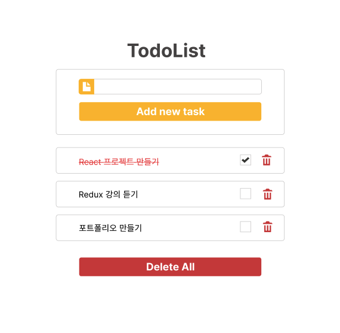
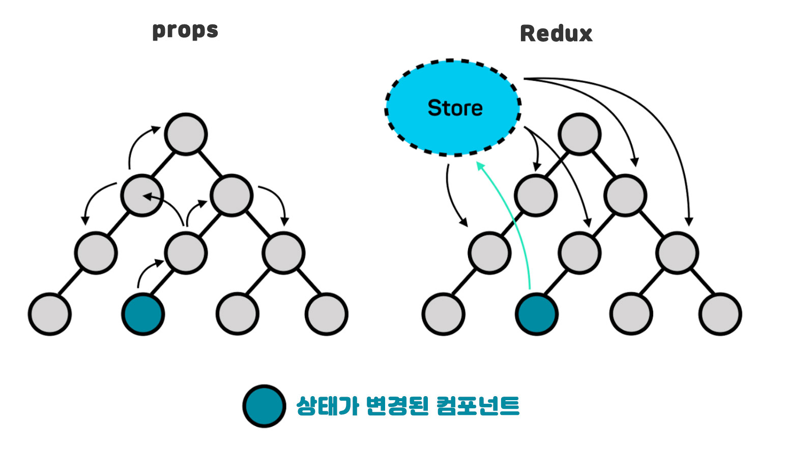
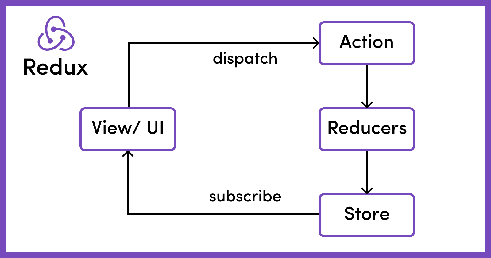

# REACT TODOLIST 만들기
- REACT 및 REDUX 로 구성한 TODOLIST 만들기

## 데모사이트
- [https://react-todolist-red.vercel.app/]

## 디자인 구현
- [디자인 구현][https://www.figma.com/file/BSGEY2DiS9EjQP4c6NN5sd/TodoList?node-id=0%3A1&t=i15ebWFgSFVZNJ5F-1]




## 구성 트리

```
src
 ┣ Components
 ┃ ┣ TodoList // 작성한 todolist 나열 콤포넌트
 ┃ ┃ ┣ TodoList.css
 ┃ ┃ ┗ TodoList.js 
 ┃ ┗ TodoListForm // todolist 작성하는 Form
 ┃ ┃ ┣ TodoListForm.css
 ┃ ┃ ┗ TodoListForm.js
 ┣ img
 ┃ ┗ design.png
 ┣ redux
 ┃ ┣ store.js 
 ┃ ┗ todoSlice.js
 ┣ App.js
 ┣ index.css
 ┗ index.js
```

## 사용한 도구


## 설치한 라이브러리
- npm install @reduxjs/toolkit react-redux
- npm install react-icons --save

## What i learn today

### 리덕스 란?
- Redux는 애플리케이션의 상태를 관리하기 위한 견고하고 안정적인 솔루션을 제공한다. 혼란스럽게 흩어져 있는 상태를 체계화 하여 애플리케이션을 관리하도록 도와준다. 



### 리덕스의 원칙
- 애플리케이션 상태는 모두 한 곳에서 집중 관리된다. 
- 상태는 불변(읽기 전용) 데이터 이며, 오직 액션 만이 상태 교체를 요청 할 수 있다.
- 리듀서(애플리케이션 상태를 교체하는 함수)를 통해 상태의 최종 값만 설정한다. (단순화)

### 리덕스 작동 방법?
- action을 발송하여 해당 상태를 변경함.
- reducers은 action이 발송 될때 해당되는 작업을 수행함. 즉, 동작을 지정함



*** 

### 참고 사이트 
- [https://yamoo9.github.io/react-master/lecture/rd-redux.html#redux-%E1%84%8B%E1%85%A1%E1%84%8F%E1%85%B5%E1%84%90%E1%85%A6%E1%86%A8%E1%84%8E%E1%85%A5]

***


## 보완 해야 할 점 및 추가하고 싶은 부분
- 다른 코드를 참고 하면서 Redux의 작동 원리를 익히면서 작성했다. 대략적인 흐름은 익혔지만, reducer을 작성할 때 각각의 함수의 기능을 사용하여 알맞은 결과를 찾기에 내가 함수에 많이 미숙하다는 것을 알게 되었다. 
- 자바스크립트 메서드 map, filter 등의 메서드들을 숙지하고 왜, todolist의 정보를 더하고 제거할 때 해당 함수가 사용되는지 익힐 것이다. 
- edit 기능을 추가 및 정렬 기능을 넣어 구현해볼 예정이다.